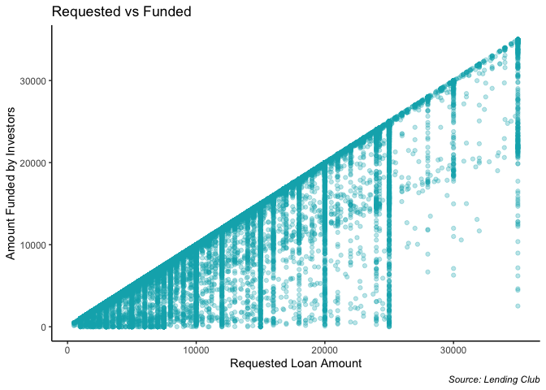
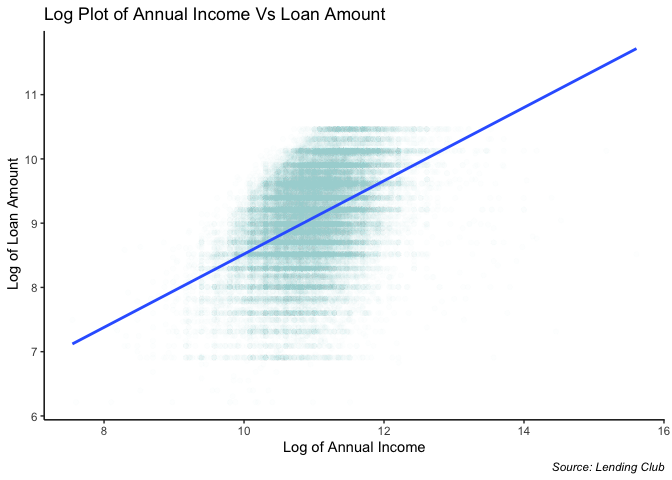
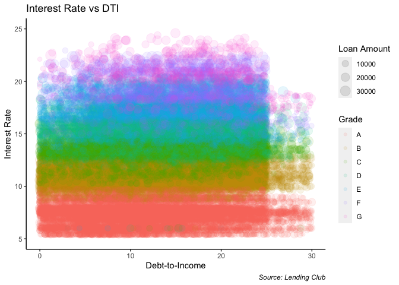
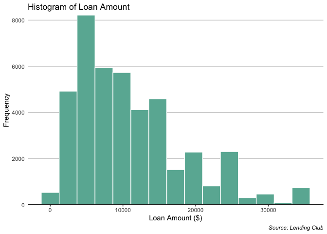
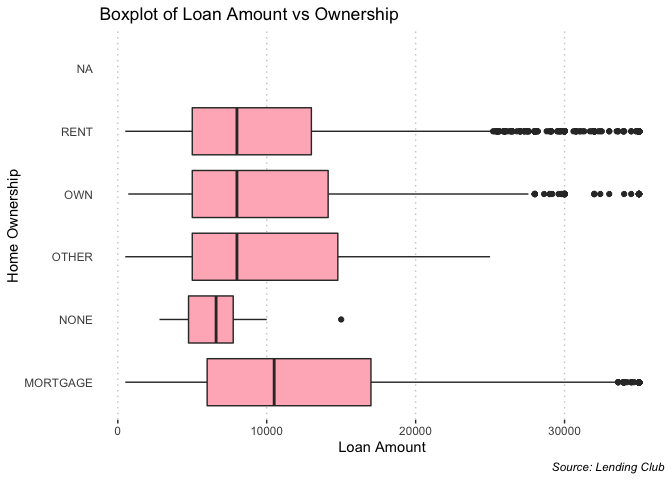
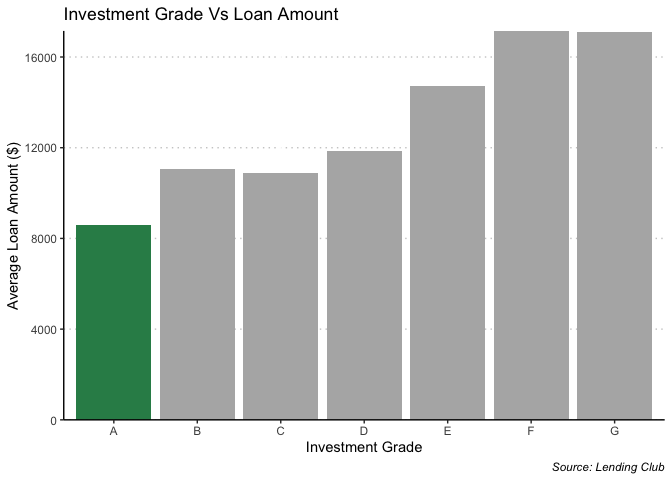
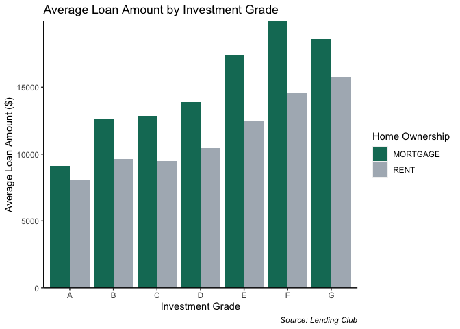
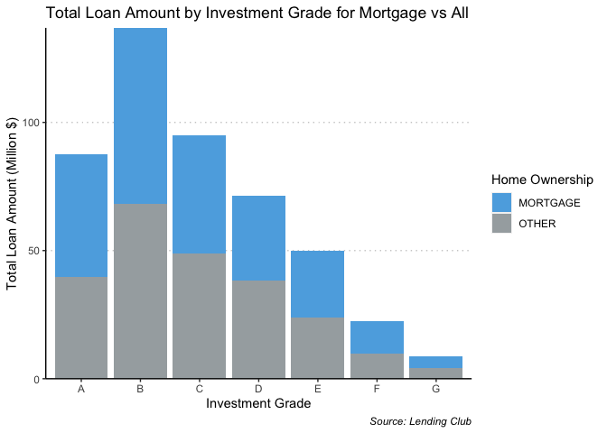

Lending Club Data
================

Scatter plots

1)  A scatter plot relating the loan amount (the amount that each
    borrower requested) to the funded amount (the amount funded by
    investors)  
    To make an attractive chart, you will have to (at least) change the
    labels on the axis, the alpha values, and the background, gridlines,
    etc.

<!-- end list -->

``` r
ggplot(lc, aes(x = loan_amnt, y = funded_amnt_inv)) + 
  geom_point(alpha = 0.3, na.rm = TRUE, color = "#00AFBB") +
  xlab("Requested Loan Amount") + 
  ylab("Amount Funded by Investors") +
  ggtitle("Requested vs Funded") +
  theme(panel.background = element_blank(), 
        axis.line = element_line(colour = 'black'),
        plot.caption = element_text(face = "italic")) +
  labs(caption = "Source: Lending Club")
```

<!-- -->

2)  A plot exploring the relationship between annual income (the
    borrower’s income) and loan amount (the amount that the borrower
    requests). Use the logarithmic scale.

<!-- end list -->

``` r
lc %>%
  select(annual_inc, loan_amnt) %>%
  drop_na() %>%
  ggplot(aes(x = log(annual_inc), y = log(loan_amnt))) +
  geom_point(alpha = .02, color = 'lightblue') + 
  stat_smooth(method="lm", se=FALSE) +
  xlab("Log of Annual Income") + 
  ylab(" Log of Loan Amount") + 
  ggtitle("Log Plot of Annual Income Vs Loan Amount") +
  theme(panel.background = element_blank(),
        axis.line = element_line(colour = 'black'),
        plot.caption = element_text(face = "italic")) +
  labs(captions = " Source: Lending Club")
```

    ## `geom_smooth()` using formula 'y ~ x'

<!-- -->

3)  Bubble Chart and Colors

<!-- end list -->

``` r
lc %>% 
  select(loan_amnt, int_rate, grade, dti) %>%
  drop_na() %>%
  mutate(int_rate_numeric = as.numeric(gsub("\\%", "", int_rate))) %>%
  ggplot(aes(x = dti, 
              y = as.numeric(int_rate_numeric), 
             size = loan_amnt, 
             color = grade)) + 
  geom_point(alpha=0.1) +
  xlab("Debt-to-Income") + 
  ylab("Interest Rate") + 
  ggtitle("Interest Rate vs DTI") +
  theme(panel.background = element_blank(),
        axis.line = element_line(colour = 'black'),
        plot.caption = element_text(face = "italic")) +
  scale_x_continuous(breaks=c(0,10,20,30), 
                     labels = c('0','10','20','30'), 
                     limits = c(0,30)) +
  scale_y_continuous(breaks=c(5,10,15,20,25), 
                     labels = c('5','10','15','20','25'), 
                     limits = c(5,25)) +
  labs(size = "Loan Amount", 
       color = "Grade",
       caption = " Source: Lending Club")
```

<!-- -->

## Part 2: Distributions

1)  A histogram to show the distribution of the Loan Amount (the amount
    requested by the borrower). Make sure to change the border color of
    the bars and change the x and y-axis labels.

<!-- end list -->

``` r
ggplot(lc, aes(x = loan_amnt)) +
  geom_histogram(bins = 15, na.rm = TRUE, fill="#69b3a2", color="white") +
  ggtitle("Histogram of Loan Amount") +
  xlab("Loan Amount ($)") +
  ylab("Frequency") +
  theme(panel.background = element_blank() , 
        axis.line = element_line(colour = 'black'),
        panel.grid.major.y = element_line(color = "grey80"),
        panel.grid.major.x = element_blank(),
        axis.line.y = element_blank(),
        axis.ticks.y = element_blank(),
        plot.caption = element_text(face = "italic")) +
  scale_y_continuous(expand = c(0,0)) +
  labs(caption = "Source: Lending Club")
```

<!-- -->

2)  Comparing the distribution of the loan amount by the homeownership
    status by creating a chart that shows some distribution information
    for each level of home ownership. In particular, make sure that your
    chart describes the median loan amount for each home ownership
    status.

<!-- end list -->

``` r
lc %>% 
  select(home_ownership, loan_amnt)  %>%
  ggplot(aes(x = loan_amnt, y = home_ownership)) +
  geom_boxplot(fill = 'lightpink' ) +
  xlab("Loan Amount") +
  ylab("Home Ownership") +
  ggtitle("Boxplot of Loan Amount vs Ownership") +
  theme(panel.background = element_blank(), 
        axis.line = element_line(colour = 'black'),
        axis.line.y = element_blank(),
        axis.line.x = element_blank(),
        panel.grid.major.x = element_line(color = 'grey80', linetype = 3),
        axis.ticks.y = element_blank(),
        plot.caption = element_text(face = "italic")) +
  labs(caption = "Source: Lending Club")
```

    ## Warning: Removed 3 rows containing non-finite values (stat_boxplot).

<!-- -->

## Part 3: Categorical plot

1)  A bar chart with the average Loan Amount by Investment Grade for
    2011. Ensure that readers can easily identify the Loan Grade with
    the lowest average Loan Amount.

<!-- end list -->

``` r
lc %>% 
  filter(issue_year == 2011) %>%
  select(loan_amnt,grade) %>%
  group_by(grade) %>% 
  summarise(avg_loan_amnt = mean(loan_amnt)) %>% 
  as.data.frame() %>%
  drop_na() %>%
  mutate(mincolor = ifelse(avg_loan_amnt == min(avg_loan_amnt), '1', '0')) %>%
  ggplot(aes(x = grade, y = avg_loan_amnt, fill = mincolor)) +
  geom_col(na.rm = TRUE, 
           fill = c('seagreen', 'grey70', 'grey70', 
                    'grey70', 'grey70', 'grey70', 'grey70')) +
  theme(panel.background = element_blank() , 
        axis.line = element_line(colour = 'black'), 
        legend.position = 'none',
        panel.grid.major.y = element_line(color = 'grey80', linetype = 3),
        plot.caption = element_text(face = "italic")) +
  xlab("Investment Grade") +
  ylab("Average Loan Amount ($)") + 
  ggtitle("Investment Grade Vs Loan Amount") +
  scale_y_continuous(expand = c(0,0)) +
  labs(caption = "Source: Lending Club")
```

<!-- -->

2)  The average loan amount by investment grade for mortgage holders
    vs. renters, in 2011.

<!-- end list -->

``` r
lc %>% 
  filter(issue_year == 2011, home_ownership =='RENT' | home_ownership == 'MORTGAGE') %>%
  select(loan_amnt,grade,home_ownership) %>%
  group_by(grade, home_ownership) %>% 
  summarise(avg_loan_amnt = mean(loan_amnt)) %>% 
  as.data.frame() %>%
  drop_na() %>%
  ggplot(aes(x = grade, y = avg_loan_amnt, fill = home_ownership)) +
  geom_bar(stat = 'identity', position = 'dodge') +
  theme(panel.background = element_blank(),
        axis.line = element_line(colour = 'black'),
        plot.caption = element_text(face = "italic")) +
  xlab("Investment Grade") +
  ylab("Average Loan Amount ($)") +
  ggtitle("Average Loan Amount by Investment Grade") +
  labs(fill = "Home Ownership", 
       caption = "Source: Lending Club") +
  scale_fill_manual(values = c(MORTGAGE = "#117A65", RENT = "#AEB6BF")) +
  scale_y_continuous(expand = c(0,0))
```

<!-- -->

3)  The total loan amount by investment grade in 2011. Break each year
    into mortgage holders vs. all others.

<!-- end list -->

``` r
lc %>% 
  filter(issue_year == 2011) %>%
  select(loan_amnt,grade,home_ownership) %>%
  mutate(home_ownership = replace(home_ownership, home_ownership!= 'MORTGAGE', 'OTHER')) %>%
  group_by(grade, home_ownership) %>% 
  summarise(total_loan_amnt = sum(loan_amnt)) %>%
  drop_na() %>%
  ggplot(aes(x = grade, y = total_loan_amnt/1000000, fill = home_ownership)) +
  geom_bar(stat = 'identity') +
  theme(panel.background = element_blank() , 
        axis.line = element_line(colour = 'black'),
        panel.grid.major.y = element_line(color = 'grey80', linetype = 3),
        plot.caption = element_text(face = "italic")) +
  xlab("Investment Grade") +
  ylab("Total Loan Amount (Million $)") +
  ggtitle("Total Loan Amount by Investment Grade for Mortgage vs All") +
  labs(fill = "Home Ownership", caption = "Source: Lending Club") +
  scale_y_continuous(expand = c(0,0)) +
  scale_fill_manual(values= c(MORTGAGE = "#5DADE2", OTHER = "#A6ACAF"))
```

<!-- -->
